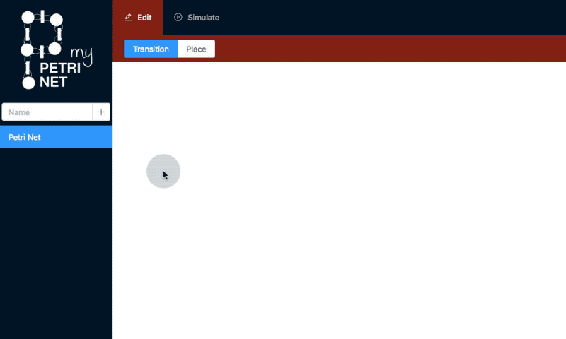

# [My Petri Net](https://my-petri-net.patrickrompf.de)

My Petri Net is a web application to model and simulate place-/transition nets. Place-/transition nets are a class of petri nets that support maximum capacities for places and weights for arcs. Petri nets can be used to model distributed systems.

The app can be used to draw a place-/transition net by adding places and transitions and connecting them with arcs. At the same time the user can configure the label, capacity, initial marking and weight for the single compoennts. After drawing a net it's possible to play the token game to watch the behaviour of the net.

My Petri Net can be accessed at https://my-petri-net.patrickrompf.de.

## Demo

## Build

The app was bootstrapped with [Create React App](https://github.com/facebook/create-react-app). You can use `npm run build` to build the app. For more information refer to [Create React App documentation](https://facebook.github.io/create-react-app/docs/production-build).

## License

My Petri Net is licensed under [MIT](LICENSE).
